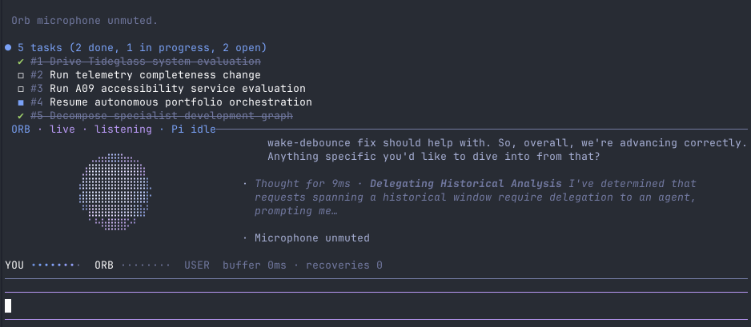

> [!WARNING]
> **Early-stage software.** Orb is pre-1.0 and under active development. It is unstable and changes a lot between releases — expect breaking changes, rough edges, and issues (including audio glitches and configuration churn). Please file bugs you hit; this project gets better with real-world use, but treat it as experimental, not production-ready.

<div align="center">


# Orb

**Conversational realtime voice for the Pi coding harness.**

[](https://github.com/alainux/orb/actions/workflows/ci.yml)
[](https://www.npmjs.com/package/@alainux/orb)




</div>

Orb adds a full-duplex voice layer to [Pi](https://pi.dev). Talk about the project at a high level; Orb turns your intent into useful engineering work, drives Pi while it works, interrupts or redirects it when needed, and comes back with the outcome rather than narrating every command.

You can keep using Pi normally at the same time. Your keyboard, Pi's editor, Pi's own output, and direct `!` commands remain visible and independent.

## Contents

- [What it feels like](#what-it-feels-like)
- [Interface](#interface)
- [Install](#install)
- [Usage](#usage)
  - [Providers](#providers)
  - [Commands](#commands)
  - [Keyboard shortcuts](#keyboard-shortcuts)
  - [Preferences](#preferences)
- [Pi control](#pi-control)
  - [Permissions](#permissions)
- [Scratchpad](#scratchpad)
- [Audio reliability](#audio-reliability)
- [Configuration](#configuration)
- [Long-running sessions](#long-running-sessions)
- [Development](#development)
- [Project layout](#project-layout)
- [Documentation](#documentation)
- [License](#license)

## What it feels like

> **You:** Can you explore the project?
>
> **Orb:** Sure — one sec.
>
> *Orb delegates a complete repository exploration, including the relevant build/tests, and waits while Pi works.*
>
> **Orb:** It’s a TypeScript Pi package with a native audio sidecar. The build is healthy; the release path is the main area I’d tighten.

Change direction at any point:

> **You:** Wait, never mind. Focus on the failing tests instead.
>
> *Orb cancels the current Pi turn and delegates the new task.*
>
> **Orb:** Got it.

No routine “shall I continue?” prompts.

## Interface

Orb inherits Pi's active theme and renders a compact panel above Pi:

- **Left:** a living, positive-space sphere of dots animated from real seeded noise — Perlin fBm + domain warping (ported from the site's labs) — carrying a drifting two-energy-region color field across the theme's primary↔secondary anchors. Talking (composing) reads as a crisp two-tone sphere with a white pressure bloom, working (searching) calms it with a broad cognition sweep, idle (smoke) is a quiet presence that keeps flowing while muted renders it gray. Sharp audio onsets birth center-to-edge pressure pulses that swell the body and bloom a sparse particle halo.
- **Right:** a chronological script of `YOU`, `ORB`, and Orb's own tool/control actions.
- **Below:** the normal Pi screen and prompt editor remain untouched.

When the scratchpad is open, the right side becomes the working document with a small recent-turn strip below it.

## Install

### Pi package

```bash
pi install https://github.com/alainux/orb
pi
```

Then start a session with:

```text
/voice
```

### Convenience launcher

macOS / Linux:

```bash
curl -fsSL https://raw.githubusercontent.com/alainux/orb/main/scripts/install.sh | sh
orb
```

Windows PowerShell:

```powershell
iwr https://raw.githubusercontent.com/alainux/orb/main/scripts/install.ps1 -UseBasicParsing | iex
orb
```

The launcher simply starts Pi with Orb auto-enabled. Plain `pi` + `/voice` remains fully supported.

### npm

```bash
npm install -g @alainux/orb
orb
```

Published releases ship platform audio binaries. Go is kept as the audio-helper implementation language and developer fallback; normal users should not need to build it.

## Usage

### Providers

Gemini Live:

```bash
export ORB_PROVIDER=gemini
export GEMINI_API_KEY="your-key"
```

OpenAI Realtime:

```bash
export ORB_PROVIDER=openai
export OPENAI_API_KEY="your-key"
```

### Commands

| Command | Description |
| --- | --- |
| `/voice` | Start voice mode with the configured provider |
| `/voice start gemini` | Start with Gemini Live |
| `/voice start openai` | Start with OpenAI Realtime |
| `/voice stop` | Stop voice mode (`off` works too) |
| `/voice status` | Show the current session status |
| `/voice log` | Show the conversation and tool log |
| `/voice settings` | Open the interactive settings panel (`prefs` works too) |
| `/voice help` | List the available commands |
| `/voice provider gemini\|openai` | Set the provider for the next session (persisted) |
| `/voice mute` | Toggle microphone mute |
| `/voice mute on` / `/voice mute off` | Mute or unmute the microphone |
| `/voice voice` | Cycle to the next voice live (persisted) |
| `/voice voice <name>` | Set a specific voice by name (persisted) |
| `/voice voice list` | List the available voices |
| `/voice thinking` | Cycle the reasoning display (`minimized` / `full` / `hidden`) |
| `/voice scratchpad` | Open the scratchpad widget |
| `/voice scratchpad open\|close` | Open or close the scratchpad |
| `/voice scratchpad view` | Open the document in the scrollable overlay |
| `/voice scratchpad edit` | Edit the document in Pi's editor |
| `/voice scratchpad load <path>` | Load a file into the scratchpad |
| `/voice scratchpad save [path]` | Save the scratchpad to a file |
| `/voice scratchpad dispatch` | Send the document (or a selection) to Pi |

### Keyboard shortcuts

| Shortcut | Action |
| --- | --- |
| `Ctrl+Alt+V` | Toggle voice mode |
| `Ctrl+Alt+M` | Mute or unmute the microphone |
| `Ctrl+Alt+T` | Cycle the reasoning display |

### Preferences

- **Durable preferences** — provider, model, voice, auto-start, reasoning budget, context compression, session resumption, braille, and audio tuning live in the config file and are read at startup.
- **Reasoning display** — `ui.thinkingDisplay` (`full` / `minimized` / `hidden`) is honored as the source of how the model's thought is surfaced. You can flip it for the current session with `/voice thinking` or `Ctrl+Alt+T` — that edits the option in memory only, never a file and never a session entry, and a fresh launch starts from the config default again.
- **Settings panel** — `/voice settings` opens a Pi settings panel: the **Reveal reasoning** toggle (session-only), the **Provider / Voice / Auto-start voice** preferences (editable and persisted to the user config), and the remaining durable values as read-only reference (edit those in the config file).

## Pi control

Orb can direct the active Pi harness through Pi's extension APIs instead of pretending slash commands are text. The voice companion deliberately only exercises the orchestration surface of the harness — it never configures Pi.

**What it can do:**

- Cancel the active generation/tool run.
- Delegate every real coding task to Pi — the companion never edits the project itself (it holds no `read`/`bash`/`write`/`edit`/`grep`/`find`/`ls` tools); it translates your requirements and directs the background agent.
- Wait for visible Pi activity or completion and inspect results.

**What it never does:**

- Switch Pi's model, change its thinking level, enable or disable its tools, run a shell, or change the voice agent's own voice. Those are set by the config file, not changed at runtime or by voice.

This makes sequences such as **cancel → delegate something else** possible entirely by voice.

Direct user `!` commands and their visible output are observed as part of Orb's internal Pi context when Pi exposes them. Pi's `!!` form stays deliberately excluded from model context. Orb does not duplicate Pi's own log in its panel because you can already see it on screen.

### Permissions

These capabilities are independently configurable, scoped to orchestration only (cancel) and the scratchpad. There are deliberately no runtime configuration knobs — the model, thinking level, tools, shell, and the voice model's own voice are set by the config file, not changed by voice:

```json
{
  "permissions": {
    "scratchpadRead": true,
    "scratchpadWrite": true,
    "scratchpadOutsideProject": false,
    "cancelPi": true
  }
}
```

- **The companion is a purely communicative layer.** It can talk to the human, read the visible Pi log (`read_pi_log` — recent conversation and tool results) to understand factual project state, delegate everything that needs the project's files changed (`run_pi_task`), observe Pi (`observe_pi`), and manage its ephemeral scratchpad.
- **It holds no project files.** There is no `read`/`bash`/`write`/`edit`/`grep`/`find`/`ls` and no `read_herdr_pane`; it cannot inspect or touch the tree itself and is intentionally limited to a read-only view of what is already visible.
- **Cancellation is the only control surface.** When you say "cancel / stop / drop that", it calls `cancel_pi_task`, which aborts the running Pi task via `ctx.abort()`. It is gated by the `cancelPi` permission, never changes model/thinking/tools/shell or configuration, and is a safe no-op when Pi is already idle.
- **Prompt overrides.** The system prompt can be overridden with `ORB_SYSTEM_PROMPT` / `PI_VOICE_SYSTEM_PROMPT` or a `voice.systemPromptFile`; the per-tool permission gates (`scratchpadRead`, `scratchpadWrite`, `scratchpadOutsideProject`, `cancelPi`) still apply.

## Scratchpad

The scratchpad is an ephemeral working document for cases where a single spoken command is not enough: long prompts, TODOs, review notes, requirements, migration plans, and so on.

Examples:

```text
"Open the scratchpad and load TODO.md."
"Add an item about retry behavior."
"Dispatch the first three items to Pi."
"Save this as docs/release-plan.md."
```

- **Operations** — open / read / replace / append / load / save / dispatch / close. Dispatch can send the whole document or a selected subset. File reads and writes are project-scoped by default.
- **Viewing** — `/voice scratchpad view` opens the document in a focusable, scrollable overlay that renders it as Markdown using Pi's active theme. It follows the live tail while the agent appends (so new lines arrive at the bottom), and you can scroll with `↑/↓`, `PgUp/PgDn`, `Ctrl+U/D`, `Home/End`; `r` re-reads the latest content and `Esc`/`q` closes it. Without a command, the inline widget panel shows a live window of the same document during a session.

## Audio reliability

The audio device is owned by a small Go/miniaudio sidecar; Node never paces speaker samples. The sidecar also owns an adaptive hardware-side jitter buffer.

```text
realtime provider ⇄ TypeScript transport ⇄ Go jitter buffer ⇄ hardware callback
```

If Pi briefly stalls provider delivery while rendering or running tools, playback pauses, rebuilds a small lead, and resumes at the hardware clock rather than getting stuck emitting tiny fragments. The buffer never skips or time-compresses PCM. A recovery counter is shown in the Orb footer and diagnostics.

Two safeguards make that recovery *automatic* rather than incidental:

- **Faster re-prime on a choppy spiral.** If a second underrun arrives while the previous rebuild has not yet delivered a healthy lead, the buffer escalates the adaptive lead by a larger step so playback re-buffers in fewer, shorter interruptions (a long tail of single-glitch gaps never forms).
- **Latency doesn't accumulate.** After delivery has been continuously healthy for a sustained streak (or a response ends naturally), the adaptive lead relaxes back toward its base, so a choppy episode never leaves permanently elevated latency behind for the next turn.

Orb also **auto-detects choppiness onset** from the sidecar's underrun-recovery counter (a lone recovery is a normal transient stall; a cluster inside a short window is real choppiness), surfaces it live (`CHOPPY` in the Orb footer + `audio choppy · adjusting` status), and — when the microphone dropped frames during the same episode — automatically resyncs the capture path so the next human turn starts from clean audio rather than a garbled half-sentence.

Barge-in clears the old response immediately. Repeated interruption storms are detected and the input path is resynchronized to break speaker→microphone feedback loops.

**Configuration.** Audio tuning is configurable:

```json
{
  "audio": {
    "bufferMs": 140,
    "maxBufferMs": 380,
    "recoveryStepMs": 40,
    "interruptionStormCount": 3,
    "interruptionStormWindowMs": 1800,
    "interruptionRecoveryMuteMs": 320,
    "choppinessWindowRecoveries": 3,
    "choppinessWindowMs": 1500,
    "choppinessRecoverSilenceMs": 1500,
    "inputResyncDrops": 3,
    "inputResyncWindowMs": 1500,
    "inputResyncCooldownMs": 4000
  }
}
```

**Diagnostics.** Run `npm run doctor` for the active helper and provider diagnostics.

## Configuration

Orb merges configuration in order (later values win):

1. `~/.config/orb/config.json` (`%APPDATA%\\orb\\config.json` on Windows)
2. `<project>/.orb/config.json`
3. `ORB_CONFIG=/some/config.json`
4. environment overrides

The voice system prompt is a simple two-layer model: a **single authoritative default** at [`prompts/default.md`](prompts/default.md) (identity, invariants, persona, tool guidance, and delegation behavior), plus an **optional user override**. An override — `voice.promptFile`, `ORB_PROMPT_FILE`, or an inline `voice.systemPrompt` — replaces the default wholesale.

Orb also starts voice automatically when a Pi session begins (on by default). Set `autoStartVoice` to `false` to opt out, or `ORB_AUTO_START=false`.

**Example:**

```json
{
  "provider": "gemini",
  "autoStartVoice": true,
  "voice": {
    "temperature": 0.83,
    "promptFile": ".orb/voice-prompt.md"
  },
  "ui": {
    "panelHeight": 12,
    "activityLines": 8,
    "orbDensity": 1.30,
    "orbReactivity": 0.7,
    "orbBraille": true
  },
  "scratchpad": {
    "panelHeight": 18,
    "maxBytes": 524288
  }
}
```

See [Configuration](docs/CONFIGURATION.md) for the full reference.

## Long-running sessions

Gemini Live periodically rotates connections. Orb enables context-window compression and Developer-API session resumption, stores the current resumption handle, closes expiring sockets promptly on `GoAway`, and reconnects. If it cannot safely resume, voice closes with a friendly message and can be reopened with `/voice`; Pi itself stays alive.

## Development

```bash
git clone https://github.com/alainux/orb.git
cd orb
npm install --ignore-scripts
npm run check
npm run build:audio
pi -e ./extensions/voice.ts
```

`npm run build:audio` uses `go build -mod=mod`, so dependencies from `audio-helper/go.mod` are resolved automatically. There is no manual `go get` step.

**Useful targets:**

| Target | Purpose |
| --- | --- |
| `npm run typecheck` | Type-check the source |
| `npm test` | Run the unit test suite |
| `npm run coverage` | Run tests with a V8 coverage report |
| `npm run coverage:ci` | Same, with enforced thresholds + headless-excluded modules |
| `npm run test:audio-helper` | Run the Go audio-helper tests |
| `npm run build` | Build `dist/` |
| `npm run smoke` | Smoke-load the built extension |
| `npm run pack:check` | Dry-run the package tarball |

**Test coverage.** Both coverage targets compile to `.test-dist/` and run the same suite with Node's built-in experimental coverage (`--experimental-test-coverage`):

- `npm run coverage` prints line / branch / function coverage for every loaded module.
- `npm run coverage:ci` applies the same run but *enforces* thresholds (≥80% line, ≥80% branch, ≥75% function) — CI fails when a threshold is missed — and excludes the `providers/`, `audio/`, and `controller.js` modules, whose uncovered paths are inherently live-network / native-hardware (not meaningfully coverable headlessly).

The runner reports line, branch, and function percentages only; it does not emit a separate “statement” figure (line coverage is the closest analogue). For type-source mapped coverage with a statement column, point `c8` at `.test-dist/tests/*.test.js`.

## Project layout

```text
extensions/        Pi package entry point
src/providers/     Gemini / OpenAI realtime adapters
src/audio/         Node ↔ Go audio transport
audio-helper/      hardware-clocked audio + adaptive playout buffer
src/controller.ts  voice/Pi orchestration
src/types.ts       OrbPermissions — the voice agent's permission gates
src/pi-log.ts      visible Pi observation used internally
src/scratchpad.ts  ephemeral collaborative document
src/orb.ts         positive-space noise-field orb (listening/speaking/thinking)
src/widget.ts      Pi-themed UI
prompts/           configurable voice-agent prompt
config/            example configuration
site/              static project website
```

## Documentation

- [Architecture](docs/ARCHITECTURE.md)
- [Configuration](docs/CONFIGURATION.md)
- [Releasing](docs/RELEASING.md)
- [Contributing](CONTRIBUTING.md)

## License

MIT. See [LICENSE](LICENSE).
