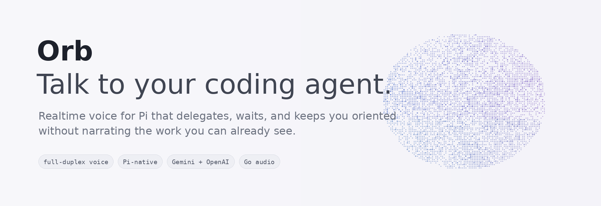

<p align="center">
  
</p>

<h1 align="center">Orb</h1>

<p align="center"><strong>Conversational realtime voice for the Pi coding harness.</strong></p>

<p align="center">
  <a href="https://github.com/alainux/orb/actions/workflows/ci.yml"></a>
  <a href="https://www.npmjs.com/package/@alainux/orb"></a>
  
  
  
</p>

<p align="center"></p>

Orb adds a full-duplex voice layer to [Pi](https://pi.dev). Talk about the project at a high level; Orb turns your intent into useful engineering work, drives Pi while it works, interrupts or redirects it when needed, and comes back with the outcome rather than narrating every command.

You can keep using Pi normally at the same time. Your keyboard, Pi's editor, Pi's own output, and direct `!` commands remain visible and independent.

## What it feels like

> **You:** Can you explore the project?
>
> **Orb:** Sure — one sec.
>
> *Orb delegates a complete repository exploration, including the relevant build/tests, and waits while Pi works.*
>
> **Orb:** It’s a TypeScript Pi package with a native audio sidecar. The build is healthy; the release path is the main area I’d tighten.

Change direction at any point:

> **You:** Wait, never mind. Use Sonnet and focus on the failing tests.
>
> *Orb cancels the current Pi turn, switches the Pi model, and delegates the new task.*
>
> **Orb:** Got it.

No narrated `ls`. No routine “shall I continue?” prompts.

## Interface

Orb inherits Pi's active theme and renders a compact panel above Pi:

- **Left:** a dense solid sphere of dots whose traveling wave pattern reacts to you and Orb — mic input widens the carved grooves and intensifies the color, while a silent or muted sphere keeps the same gentle wave flowing at minimum disturbance.
- **Right:** a chronological script of `YOU`, `ORB`, and Orb's own tool/control actions.
- **Below:** the normal Pi screen and prompt editor remain untouched.

When the scratchpad is open, the right side becomes the working document with a small recent-turn strip below it.

## Install

### Pi package

```bash
pi install https://github.com/alainux/orb
pi
```

Then:

```text
/voice
```

### Convenience launcher

macOS / Linux:

```bash
curl -fsSL https://raw.githubusercontent.com/alainux/orb/main/scripts/install.sh | sh
orb
```

Windows PowerShell:

```powershell
iwr https://raw.githubusercontent.com/alainux/orb/main/scripts/install.ps1 -UseBasicParsing | iex
orb
```

The launcher simply starts Pi with Orb auto-enabled. Plain `pi` + `/voice` remains fully supported.

### npm

```bash
npm install -g @alainux/orb
orb
```

Published releases ship platform audio binaries. Go is kept as the audio-helper implementation language and developer fallback; normal users should not need to build it.

## Provider setup

Gemini Live:

```bash
export ORB_PROVIDER=gemini
export GEMINI_API_KEY="your-key"
```

OpenAI Realtime:

```bash
export ORB_PROVIDER=openai
export OPENAI_API_KEY="your-key"
```

Commands:

```text
/voice
/voice start gemini
/voice start openai
/voice provider gemini
/voice status
/voice log
/voice mute
/voice mute on
/voice mute off
/voice scratchpad
/voice scratchpad edit
/voice scratchpad load TODO.md
/voice scratchpad save notes/plan.md
/voice scratchpad dispatch
/voice scratchpad close
/voice stop
```

`Ctrl+Alt+V` toggles voice mode; `Ctrl+Alt+M` mutes or unmutes your microphone while voice is active.

## Pi control

Orb can manage the active Pi harness through Pi's extension APIs instead of pretending slash commands are text:

- cancel the active generation/tool run;
- switch Pi models;
- change Pi's thinking level;
- enable/disable Pi tools;
- run direct shell commands for `!`-style requests;
- delegate normal coding tasks to Pi;
- wait for visible Pi activity or completion and inspect results.

This makes sequences such as **cancel → change model → retry** possible entirely by voice.

Direct user `!` commands and their visible output are observed as part of Orb's internal Pi context when Pi exposes them. Pi's `!!` form stays deliberately excluded from model context. Orb does not duplicate Pi's own log in its panel because you can already see it on screen.

### Permissions

These capabilities are independently configurable. Defaults enable Pi control while keeping scratchpad file access inside the current project:

```json
{
  "permissions": {
    "cancelPi": true,
    "setModel": true,
    "setThinking": true,
    "setTools": true,
    "shell": true,
    "scratchpadRead": true,
    "scratchpadWrite": true,
    "scratchpadOutsideProject": false
  }
}
```

Disable anything you do not want the realtime voice model to use.

## Scratchpad

The scratchpad is an ephemeral working document for cases where a single spoken command is not enough: long prompts, TODOs, review notes, requirements, migration plans, etc.

Examples:

```text
"Open the scratchpad and load TODO.md."
"Add an item about retry behavior."
"Dispatch the first three items to Pi."
"Save this as docs/release-plan.md."
```

It supports open/read/replace/append/load/save/dispatch/close. Dispatch can send the whole document or a selected subset. File reads/writes are project-scoped by default.

## Audio reliability

The audio device is owned by a small Go/miniaudio sidecar; Node never paces speaker samples. In v0.6 the sidecar also owns an adaptive hardware-side jitter buffer.

```text
realtime provider ⇄ TypeScript transport ⇄ Go jitter buffer ⇄ hardware callback
```

If Pi briefly stalls provider delivery while rendering or running tools, playback now pauses, rebuilds a small lead, and resumes at the hardware clock rather than getting stuck emitting tiny fragments. The buffer never skips or time-compresses PCM. A recovery counter is shown in the Orb footer and diagnostics.

Barge-in still clears the old response immediately. Repeated interruption storms are detected and the input path is resynchronized to break speaker→microphone feedback loops.

Audio tuning is configurable:

```json
{
  "audio": {
    "bufferMs": 140,
    "maxBufferMs": 380,
    "recoveryStepMs": 40,
    "interruptionStormCount": 3,
    "interruptionStormWindowMs": 1800,
    "interruptionRecoveryMuteMs": 320
  }
}
```

Run:

```bash
npm run doctor
```

for the active helper/provider diagnostics.

## Configuration

Orb merges, in order:

1. `~/.config/orb/config.json` (`%APPDATA%\\orb\\config.json` on Windows)
2. `<project>/.orb/config.json`
3. `ORB_CONFIG=/some/config.json`
4. environment overrides

The complete voice-agent prompt ships at [`prompts/default.md`](prompts/default.md) and can be replaced with `voice.promptFile` or `ORB_PROMPT_FILE`.

Example:

```json
{
  "provider": "gemini",
  "voice": {
    "temperature": 0.72,
    "promptFile": ".orb/voice-prompt.md"
  },
  "ui": {
    "panelHeight": 12,
    "activityLines": 8,
    "orbDensity": 1.30,
    "orbReactivity": 0.7,
    "orbBraille": true
  },
  "scratchpad": {
    "panelHeight": 18,
    "maxBytes": 524288
  }
}
```

See [Configuration](docs/CONFIGURATION.md).

## Long-running sessions

Gemini Live periodically rotates connections. Orb enables context-window compression and Developer-API session resumption, stores the current resumption handle, closes expiring sockets promptly on `GoAway`, and reconnects. If it cannot safely resume, voice closes with a friendly message and can be reopened with `/voice`; Pi itself stays alive.

## Development

```bash
git clone https://github.com/alainux/orb.git
cd orb
npm install --ignore-scripts
npm run check
npm run build:audio
pi -e ./extensions/voice.ts
```

`npm run build:audio` uses `go build -mod=mod`, so dependencies from `audio-helper/go.mod` are resolved automatically. There is no manual `go get` step.

Useful targets:

```bash
npm run typecheck
npm test
npm run test:audio-helper
npm run build
npm run smoke
npm run pack:check
```

Read [Architecture](docs/ARCHITECTURE.md), [Configuration](docs/CONFIGURATION.md), [Releasing](docs/RELEASING.md), and [Contributing](CONTRIBUTING.md).

## Project layout

```text
extensions/        Pi package entry point
src/providers/     Gemini / OpenAI realtime adapters
src/audio/         Node ↔ Go audio transport
audio-helper/      hardware-clocked audio + adaptive playout buffer
src/controller.ts  voice/Pi orchestration
src/pi-control.ts  permission-gated Pi cancellation/model/thinking/tools/shell
src/pi-log.ts      visible Pi observation used internally
src/scratchpad.ts  ephemeral collaborative document
src/orb.ts         negative-space surface orb (listening/speaking/thinking)
src/widget.ts      Pi-themed UI
prompts/           configurable voice-agent prompt
config/            example configuration
site/              static project website
```

## License

MIT. See [LICENSE](LICENSE).
